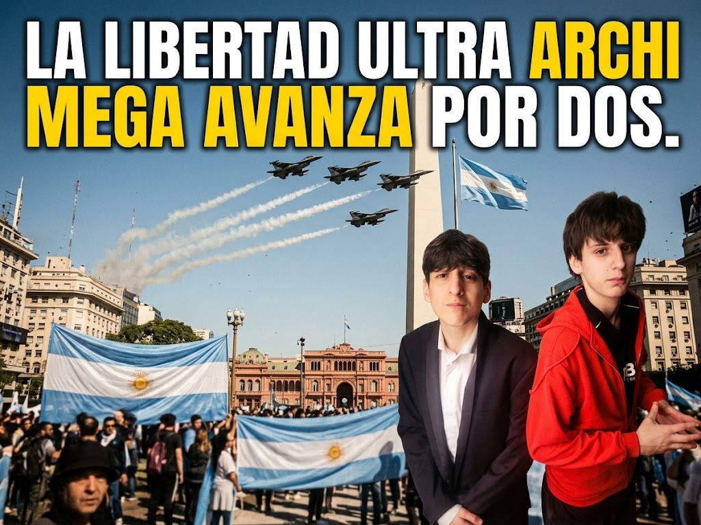

# LLUAMAx2

> Sitio web de presentación para el partido político ficticio **La Libertad Ultra Archi Mega Avanza por Dos**.

<p align="center">
  <a href="https://ldenis06.github.io/LLUAMAx2/"><strong>Ver sitio publicado</strong></a>
  &nbsp;·&nbsp;
  <a href="#contenido">Contenido</a>
  &nbsp;·&nbsp;
  <a href="#uso-local">Uso local</a>
</p>

<p align="center">
  <a href="https://ldenis06.github.io/LLUAMAx2/">
    
  </a>
</p>

## Sitio publicado

La versión pública está disponible en:

### [https://ldenis06.github.io/LLUAMAx2/](https://ldenis06.github.io/LLUAMAx2/)

## Contenido

El sitio presenta una campaña ficticia de proyecto escolar con estas secciones:

- Video introductorio de YouTube y enlace directo al video.
- Portada de campaña con imagen principal.
- Plan general: libertad, orden y futuro.
- Propuestas de seguridad, economía, educación e inmigración.
- Comparación con la política tradicional.
- Bloque de propuestas humorísticas “Nivel Archi Mega”.
- Cierre con voto ficticio local.

## Diseño y experiencia

- Paleta unificada: azul oscuro, celeste, blanco y dorado.
- Navegación fija y enlaces de desplazamiento suave.
- Microinteracciones 3D en escritorio.
- Diseño responsive para pantallas móviles y de escritorio.
- Reproductor de YouTube integrado con un enlace alternativo.
- Sin dependencias de instalación: se abre directamente desde `index.html`.

## Uso local

1. Descargá o cloná este repositorio.
2. Abrí `index.html` en cualquier navegador web moderno.

No requiere servidor, instalación ni configuración adicional.

## Estructura

```text
├── index.html                 # Estructura y contenido del sitio
├── styles.css                 # Estilos base
├── image-fix.css              # Encuadre de la imagen de campaña
├── three-d.css                # Profundidad e interacciones 3D
├── video-intro.css            # Sección de video inicial
├── responsive-palette.css     # Paleta y ajustes responsive
├── script.js                  # Navegación e interacciones
└── campaign.png               # Imagen principal de campaña
```

## Aclaración

Este repositorio contiene material ficticio creado para una presentación escolar. No representa una campaña electoral ni un partido político real.
